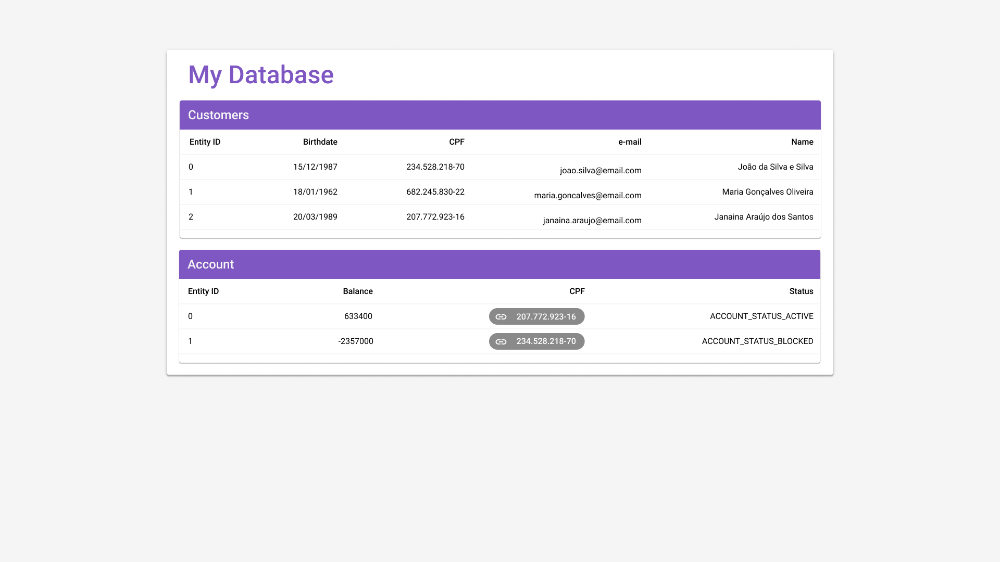

# App Layout

# Requirements
node.js
web browser (latest firefox or chrome preferred)
# To install
run `npm i`
# To build
run `npm run build`
# To test (library)
run `npm run test`
# To serve
run `npm run serve` and navigate to `http://localhost:8080`
# Todo
- bundling & minification of js/css using gulp or webpack
- split js files into modules
- use babel to compile to es3 for cross browser compatibility (?)
- use scss
- use localstorage or indexedDB to store data on the client
# Tested on
Windows 10
Node.js `v12.16.3`
Mozilla Firefox `77.0.1 (64-bit)`
Google Chrome `83.0.4103.106 (Official Build) (64-bit)`
